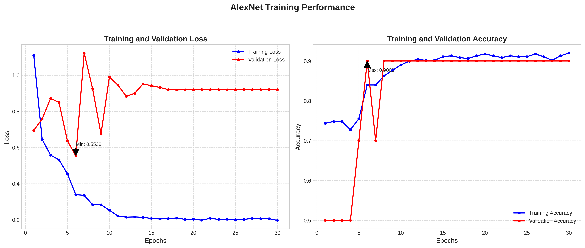
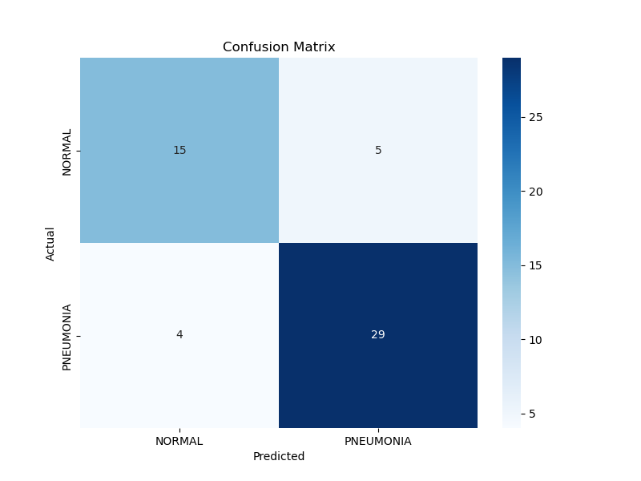

# AlexNet for Pneumonia Detection

This repository contains an implementation of AlexNet for detecting pneumonia from chest X-ray images.

## Dataset

The model is designed to work with the Chest X-ray dataset which should be organized as follows:
```
chest_xray/
├── train/
│   ├── NORMAL/
│   └── PNEUMONIA/
├── val/
│   ├── NORMAL/
│   └── PNEUMONIA/
└── test/
    ├── NORMAL/
    └── PNEUMONIA/
```

## Project Structure

- `model.py`: AlexNet model implementation
- `dataset.py`: Data loading and preprocessing
- `train.py`: Training script with regularization techniques
- `evaluate.py`: Model evaluation and metrics calculation
- `utils.py`: Utility functions for visualization and checkpoints
- `main.py`: Main script to run training or evaluation

## Features

- Data augmentation to prevent overfitting
- Dropout layers for regularization
- L2 weight regularization
- Learning rate scheduling
- Model checkpointing
- Comprehensive evaluation metrics
- Class Activation Map visualization

## Usage

### Training

```bash
python main.py --mode train --data_dir /path/to/dataset --batch_size 64 --epochs 30 --lr 0.0005 --weight_decay 1e-5
```

### Evaluating the Model

```bash
python main.py --mode evaluate --checkpoint /path/to/AlexNet/checkpoints/best_model.pth --data_dir /path/to/test_dataset
```

### Visualizing Predictions

```bash
python main.py --mode visualize --checkpoint /path/to/AlexNet/checkpoints/best_model.pth --image_path /path/to/image.jpg
```

## Techniques to Improve Generalization

1. **Data Augmentation**: Random flips, rotations, and translations to add diversity to the training data
2. **Dropout Layers**: Added with 0.5 probability to prevent overfitting
3. **L2 Regularization**: Applied to all weights via weight decay in optimizer
4. **Learning Rate Scheduler**: Reduces learning rate when validation loss plateaus
5. **Early Stopping**: Implicitly implemented by saving best model during training
6. **Balanced Evaluation**: Using precision, recall, F1-score, and confusion matrix

## Model Architecture

AlexNet consists of 5 convolutional layers followed by 3 fully connected layers:

1. Conv1: 96 filters of size 11x11, stride 4, padding 2
2. Conv2: 256 filters of size 5x5, stride 1, padding 2
3. Conv3: 384 filters of size 3x3, stride 1, padding 1
4. Conv4: 384 filters of size 3x3, stride 1, padding 1
5. Conv5: 256 filters of size 3x3, stride 1, padding 1
6. FC1: 4096 neurons
7. FC2: 4096 neurons
8. FC3: 2 neurons (binary classification)


## Visualizations

### Training Progress


### Confusion Matrix


## References

- AlexNet Implementation: https://github.com/dansuh17/alexnet-pytorch/blob/d0c1b1c52296ffcbecfbf5b17e1d1685b4ca6744/model.py#L40
- Dataset: https://www.kaggle.com/datasets/paultimothymooney/chest-xray-pneumonia
- Context: https://www.cell.com/cell/fulltext/S0092-8674(18)30154-5
